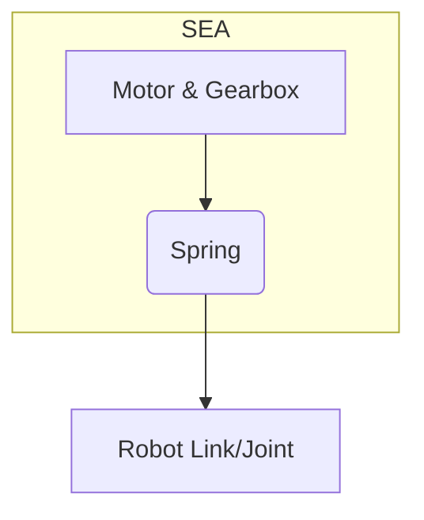

# Chapter 5: Motors, Actuators, and Power Systems

## Introduction: The Muscles and Metabolism of a Robot

If the chassis is the skeleton and the control system is the brain, then the actuators and power systems are the muscles and metabolism of a humanoid robot. Actuators convert electrical energy into mechanical motion, driving the joints and enabling movement. The power system provides the necessary energy, storing and distributing it to every component. The choices made in these domains fundamentally dictate a robot's strength, speed, efficiency, and operational endurance. This chapter explores the most common actuator technologies used in modern robotics and the critical power systems that bring them to life.

## Electric Motors: The Heart of Actuation

Electric motors are the most prevalent type of actuator in robotics due to their high efficiency, precise control, and excellent power-to-weight ratio. They are typically paired with a gearbox to reduce speed and increase torque.

### 5.1. Brushed DC Motors

Brushed DC (Direct Current) motors are a classic and straightforward type of motor.
*   **Principle**: A rotating armature (electromagnet) is surrounded by stationary permanent magnets. A mechanical commutator and brushes reverse the current direction in the armature, causing continuous rotation.
*   **Advantages**: Simple to control (speed is roughly proportional to voltage), inexpensive, and reliable for basic applications.
*   **Disadvantages**: The brushes and commutator wear down over time, creating carbon dust and limiting the motor's lifespan and maximum speed. They are also less efficient than their brushless counterparts due to friction and electrical resistance at the brushes.

### 5.2. Brushless DC (BLDC) Motors

BLDC motors represent a significant improvement over brushed motors and are the standard in high-performance robotics.
*   **Principle**: The design is inverted—the permanent magnets are on the rotor, and the electromagnets are on the stationary stator. An external electronic controller (ESC - Electronic Speed Controller) replaces the mechanical brushes, switching the current in the stator coils to generate a rotating magnetic field that "pulls" the rotor along.
*   **Advantages**: Higher efficiency, longer lifespan (no brushes to wear out), higher speed capabilities, and better heat dissipation.
*   **Disadvantages**: Require a more complex and expensive controller (the ESC) to operate.

| Feature            | Brushed DC Motor             | Brushless DC (BLDC) Motor     |
| ------------------ | ---------------------------- | ----------------------------- |
| **Control**        | Simple (Voltage-based)       | Complex (ESC required)        |
| **Lifespan**       | Limited by brush wear        | Very long                     |
| **Efficiency**     | Moderate                     | High                          |
| **Speed**          | Limited by brushes           | High                          |
| **Cost**           | Low                          | High (motor + controller)     |
| **Maintenance**    | Requires brush replacement   | Virtually none                |

### 5.3. Linear Actuators

While rotary motors provide rotational motion, linear actuators produce motion in a straight line.
*   **Principle**: Most common types use a motor (typically DC) to turn a lead screw. A nut on the screw is prevented from rotating, so it travels linearly along the screw as it turns.
*   **Applications**: Used where direct push/pull motion is needed, such as in robotic grippers, or for specific joints that require linear motion instead of rotation.
*   **Advantages**: High force, precise positioning, can hold a load without power (due to screw friction).
*   **Disadvantages**: Slower speeds compared to rotary motors, can be bulky.

## Advanced Actuation: Series Elastic Actuators (SEAs)

A critical challenge in robotics, especially for humanoids that must interact with the world, is controlling force and handling impacts. Rigid, traditional actuators are poor at this. **Series Elastic Actuators (SEAs)** are a revolutionary design that addresses this by placing a spring (an elastic element) in series between the motor/gearbox output and the final link.

The benefits of this simple addition are profound:
1.  **Force Control**: By measuring the compression or extension of the spring (e.g., with a position sensor), the actuator can precisely calculate the torque being applied to the joint. This turns a position-controlled motor into a torque-controlled actuator, which is essential for compliant and safe physical interaction.
2.  **Shock Tolerance**: The spring acts as a mechanical buffer, absorbing impacts from walking or unexpected contact. This protects the delicate gears in the gearbox from being damaged.
3.  **Energy Storage**: The spring can store and release potential energy, much like a human tendon. This can lead to more efficient and natural-looking movements, especially in cyclic motions like walking or running.
4.  **Lower Reflected Inertia**: The spring mechanically decouples the high inertia of the motor from the joint, leading to more delicate and sensitive force control.

SEAs are a key enabling technology for creating robots that can walk on uneven terrain, interact safely with people, and perform tasks requiring a delicate touch.

## Power Systems: Energy for Operation

A humanoid robot is a power-hungry machine. A robust power system is required to store and distribute high-current electrical energy safely and efficiently.

### 5.4. Batteries

The battery is the robot's energy tank. The dominant technology for mobile robotics is Lithium-ion based chemistries.
*   **Lithium Polymer (LiPo)**: High discharge rates (high C-rating) and excellent power-to-weight ratio, making them ideal for high-performance applications like drones and robotics. However, they can be volatile if mishandled (punctured, over-charged, or over-discharged).
*   **Lithium-Ion (Li-ion)**: Higher energy density (more capacity for a given weight) than LiPo, and generally safer. They are often packaged in cylindrical cells (e.g., 18650 cells). This is the preferred choice for applications requiring longer endurance.

### 5.5. Power Distribution and Management

Getting power from the battery to the dozens of motors and sensors is not trivial.
*   **Battery Management System (BMS)**: A critical safety circuit that protects the battery pack from over-charge, over-discharge, over-current, and high temperatures. It also performs cell balancing to ensure all cells in the pack are at a similar voltage, extending the battery's life.
*   **Power Distribution Board (PDB)**: A central hub that takes the main battery input and splits it into multiple outputs for different subsystems. It often includes voltage regulation (e.g., stepping down the main battery voltage to 12V or 5V for electronics) and fuses or circuit breakers for protection.

The power distribution network must be designed with thick wires capable of handling the very high peak currents drawn by multiple motors starting simultaneously, which can often exceed 100 amps in a full-sized humanoid.
